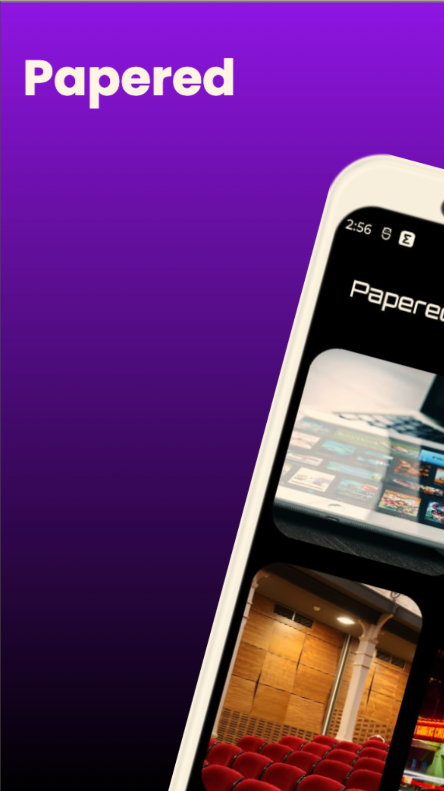
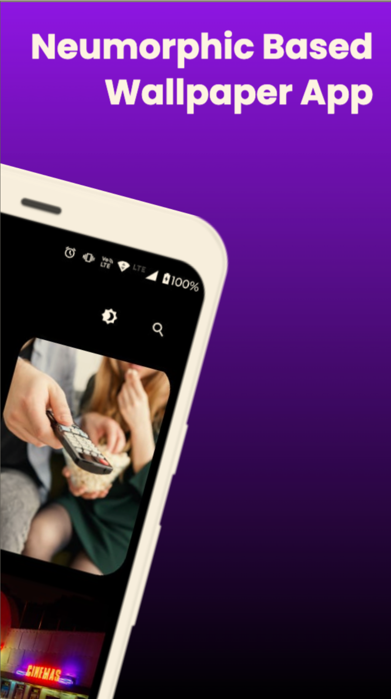
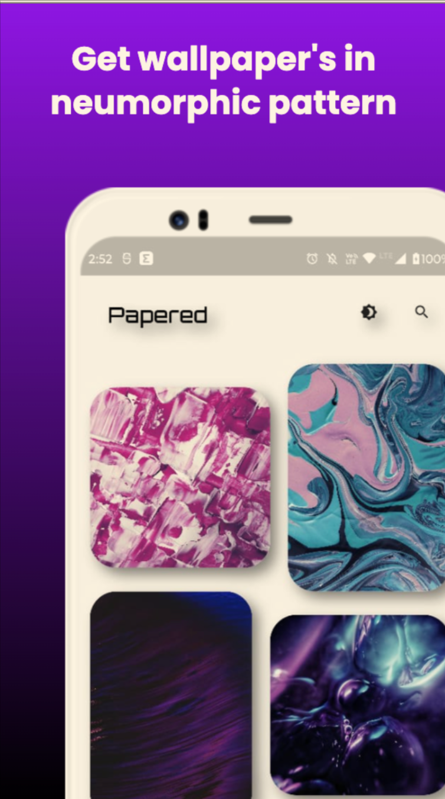
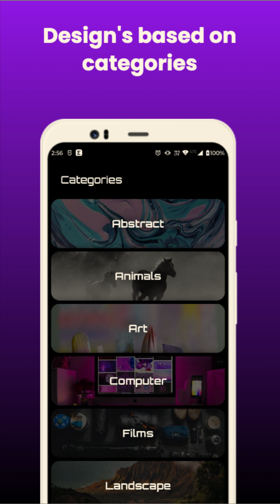
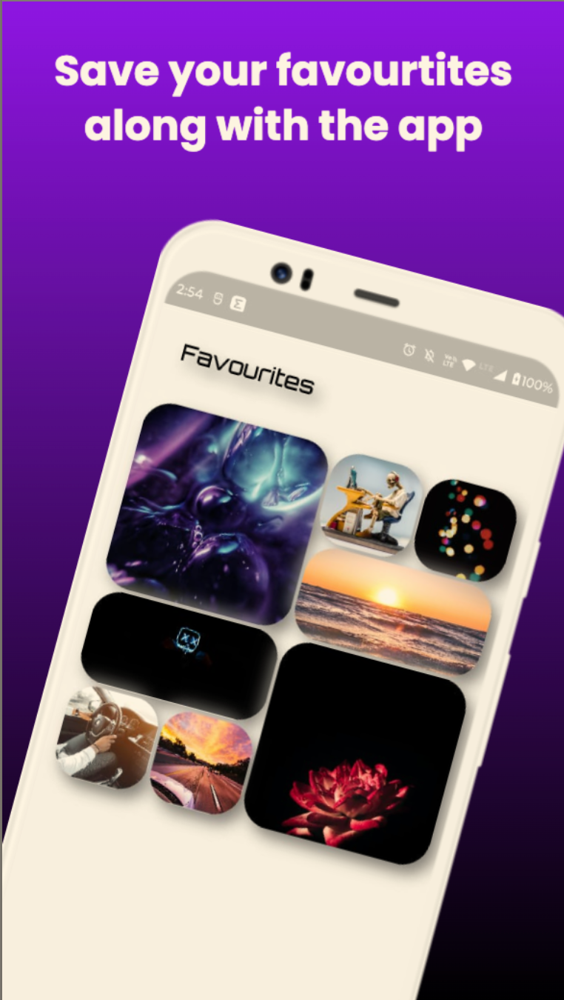
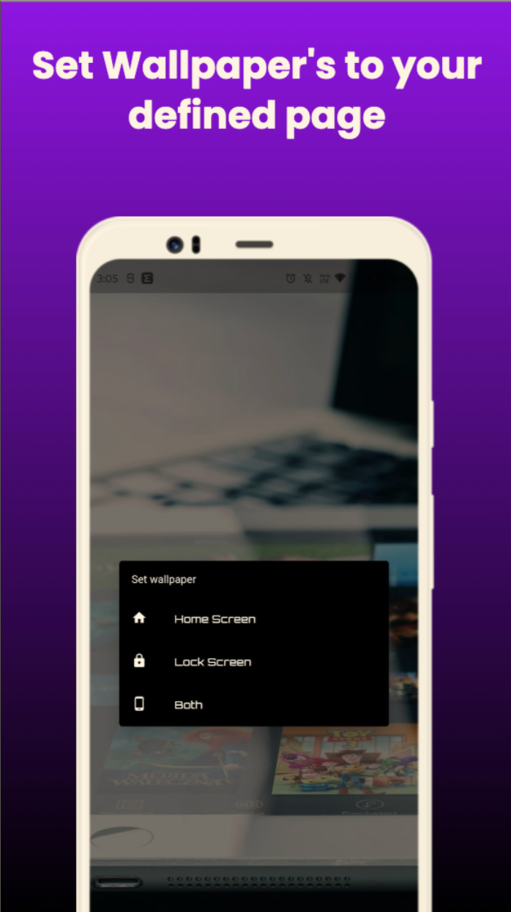
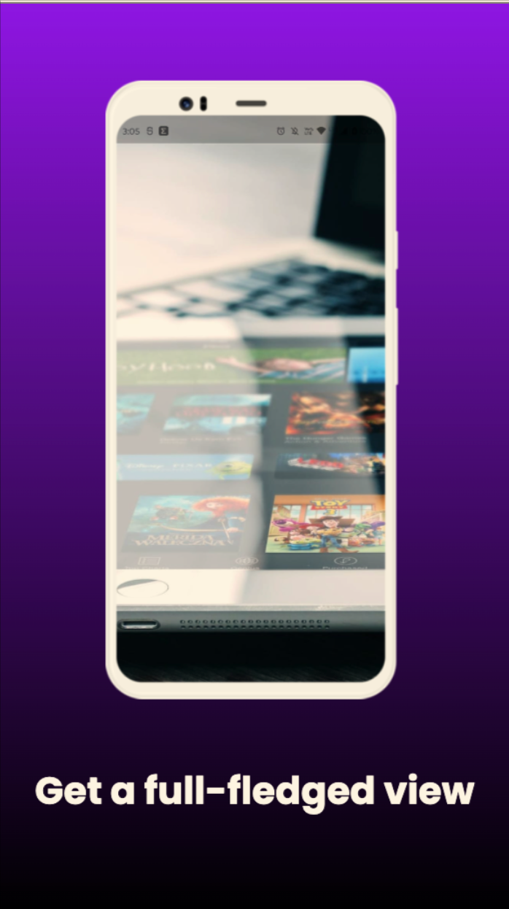

# Papered - Neumorphic Based Wallpaper App

Download it at [Google Play Store](https://play.google.com/store/apps/details?id=com.yashrajjain.papered)

## Features

- Neumorphic Design throughout the app
- Light & Dark Supported theme
- Search Images throughout the database
- Download, Apply and Favourite the wallpaper's according to you

## Screenshots
<table>
<tr>
 <td></td>   
  <td></td>
  <td></td>   
  <td></td>   
</tr>
</table>
<table>
<tr>
 <td></td>   
  <td></td>
   <td></td>   
  <td></td>   
</tr>
</table>

## Installation

```sh
git clone https://github.com/yashrajjain726/papered.git
cd papered
flutter pub get
```
